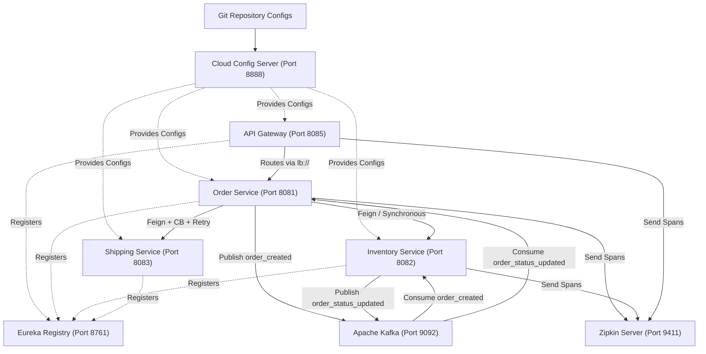

# Spring Boot & Microservices Master Repository

Welcome to the development repository containing a collection of hands-on Spring Boot modules and cloud-native microservice projects. This document serves as a comprehensive developer guide detailing the implementation steps, `pom.xml` dependencies, configurations, and core annotations used to build the functionality in each module.

---

## 📂 Project Structure

The codebase is organized into isolated Maven projects located in the [June](file:///Users/macbook/Documents/GitHub/module12.config/June) directory, alongside centralized configuration files at the repository root.

- **[June/module1homework](file:///Users/macbook/Documents/GitHub/module12.config/June/module1homework)**: Spring IoC & Dependency Injection.
- **[June/module2.homework](file:///Users/macbook/Documents/GitHub/module12.config/June/module2.homework)**: Spring MVC request validation and custom constraint validators.
- **[June/module3.homework](file:///Users/macbook/Documents/GitHub/module12.config/June/module3.homework)**: JPA entities mapping and bidirectional relationship handling.
- **[June/module4.homework](file:///Users/macbook/Documents/GitHub/module12.config/June/module4.homework)**: External HTTP clients (`RestClient`) and JPA lifecycle auditing.
- **[June/module5.homework](file:///Users/macbook/Documents/GitHub/module12.config/June/module5.homework)**: JWT authentication, custom security filters, and Spring Security.
- **[June/module7.homework](file:///Users/macbook/Documents/GitHub/module12.config/June/module7.homework)**: Multi-layer testing (Unit, MVC slice, JPA slice) and code coverage reporting.
- **[June/module12.homework](file:///Users/macbook/Documents/GitHub/module12.config/June/module12.homework)**: Advanced microservices architecture (Eureka, Config Server, Gateway, OpenFeign, Resilience4j, Kafka, Zipkin).
- **[Repository Root Configs](file:///Users/macbook/Documents/GitHub/module12.config)**: Git-backed configurations (`application.yml`, `module12.order.yml`, etc.) parsed by the Cloud Config Server.

---

## 🛠️ Detailed Chapter Guides

### 📘 Module 1: Spring IoC Container & Dependency Injection
**Goal**: Understand bean management, dependency injection models (constructor-based injection), and bean resolution techniques.

#### 1. Dependencies Added ([pom.xml](file:///Users/macbook/Documents/GitHub/module12.config/June/module1homework/pom.xml))
Uses the standard starter dependency for core Spring Boot context:
```xml
<dependency>
    <groupId>org.springframework.boot</groupId>
    <artifactId>spring-boot-starter</artifactId>
</dependency>
```

#### 2. Key Annotations Used
- `@SpringBootApplication`: Marks the entry point class [Module1homeworkApplication.java](file:///Users/macbook/Documents/GitHub/module12.config/June/module1homework/src/main/java/june/module1homework/Module1homeworkApplication.java). It triggers `@Configuration`, `@EnableAutoConfiguration`, and `@ComponentScan`.
- `@Component`: Indicated on classes like [CakeBaker.java](file:///Users/macbook/Documents/GitHub/module12.config/June/module1homework/src/main/java/june/module1homework/classes/CakeBaker.java) and [ChocolateFrosting.java](file:///Users/macbook/Documents/GitHub/module12.config/June/module1homework/src/main/java/june/module1homework/classes/ChocolateFrosting.java) to make them candidate beans for Spring's Application Context.
- `@Qualifier("beanName")`: Used in the [CakeBaker.java](file:///Users/macbook/Documents/GitHub/module12.config/June/module1homework/src/main/java/june/module1homework/classes/CakeBaker.java) constructor to resolve ambiguity when injecting interfaces with multiple implementations (`Frosting` and `Syrup` implementations).

#### 3. Execution Flow
1. Spring Boot bootstraps, scans the packages, and registers beans.
2. Multiple implementations of `Frosting` (`ChocolateFrosting`, `StrawberryFrosting`) are detected.
3. Spring resolves injection into the `CakeBaker` constructor using `@Qualifier` values.
4. Main application fetches `CakeBaker.class` from the `ApplicationContext` and triggers `bakeCake()`.

---

### 📘 Module 2: Request Validation & Custom Constraint Validators
**Goal**: Implement robust, custom constraint validation on incoming REST payloads and globally handle validation exceptions.

#### 1. Dependencies Added ([pom.xml](file:///Users/macbook/Documents/GitHub/module12.config/June/module2.homework/pom.xml))
```xml
<dependency>
    <groupId>org.springframework.boot</groupId>
    <artifactId>spring-boot-starter-validation</artifactId>
</dependency>
<dependency>
    <groupId>org.springframework.boot</groupId>
    <artifactId>spring-boot-starter-webmvc</artifactId>
</dependency>
```

#### 2. Implementations & Annotations
- **Standard Validators**: Applied on fields in [EmployeeEntity.java](file:///Users/macbook/Documents/GitHub/module12.config/June/module2.homework/src/main/java/june/module2/homework/entity/EmployeeEntity.java) (e.g., `@NotNull`, `@NotBlank`, `@Min(18)`, `@Max(50)`, `@Email`, `@Past`, `@Future`, `@CreditCardNumber`, `@URL`).
- **Custom Annotation Development**:
  - Created `@interface` [Password.java](file:///Users/macbook/Documents/GitHub/module12.config/June/module2.homework/src/main/java/june/module2/homework/anotation/Password.java) and [Prime.java](file:///Users/macbook/Documents/GitHub/module12.config/June/module2.homework/src/main/java/june/module2/homework/anotation/Prime.java).
  - Used `@Constraint(validatedBy = PasswordValidator.class)` to bind the custom annotation to the validator logic.
- **Custom Validators**:
  - [PasswordValidator.java](file:///Users/macbook/Documents/GitHub/module12.config/June/module2.homework/src/main/java/june/module2/homework/validator/PasswordValidator.java) implements `ConstraintValidator<Password, String>`. It validates string lengths and regex criteria (uppercase, lowercase, and special characters).
  - [PrimeValidator.java](file:///Users/macbook/Documents/GitHub/module12.config/June/module2.homework/src/main/java/june/module2/homework/validator/PrimeValidator.java) implements `ConstraintValidator<Prime, Integer>`, executing a mathematical prime-number check.
- **Controller-Level Triggering**:
  - Annotated `@Valid @RequestBody` in [DepartmentController.java](file:///Users/macbook/Documents/GitHub/module12.config/June/module2.homework/src/main/java/june/module2/homework/controller/DepartmentController.java) to validate input constraints prior to invoking method logic.
- **Centralized Exception Handling**:
  - Decorated [GlobalExceptionHandler.java](file:///Users/macbook/Documents/GitHub/module12.config/June/module2.homework/src/main/java/june/module2/homework/exception/GlobalExceptionHandler.java) with `@ControllerAdvice` and `@ExceptionHandler(Exception.class)` to intercept validation errors and convert them into structured HTTP response payloads.

---

### 📘 Module 3: JPA Entities, Mappings & Relationships
**Goal**: Design database models with JPA/Hibernate, configure bidirectional mappings, and prevent serialization infinite recursion.

#### 1. Dependencies Added ([pom.xml](file:///Users/macbook/Documents/GitHub/module12.config/June/module3.homework/pom.xml))
```xml
<dependency>
    <groupId>org.springframework.boot</groupId>
    <artifactId>spring-boot-starter-data-jpa</artifactId>
</dependency>
<dependency>
    <groupId>org.postgresql</groupId>
    <artifactId>postgresql</artifactId>
    <scope>runtime</scope>
</dependency>
```

#### 2. Key Annotations Used
- `@Entity` & `@Table(name = "table_name")`: Declares standard JPA-managed persistent entities.
- `@Id` & `@GeneratedValue(strategy = GenerationType.IDENTITY)`: Configures database auto-increment primary keys.
- **Mappings**:
  - `@OneToOne`: Configured in [Student.java](file:///Users/macbook/Documents/GitHub/module12.config/June/module3.homework/src/main/java/part1/module3/homework/entity/Student.java) mapping `AdmissionRecord` with cascade features (`cascade = CascadeType.ALL`).
  - `@ManyToOne` & `@JoinColumn(name = "author_id")`: Configures relationship mapping in [Book.java](file:///Users/macbook/Documents/GitHub/module12.config/June/module3.homework/src/main/java/part1/module3/homework/entity/Book.java) targeting `Author`.
  - `@ManyToMany` & `@JoinTable`: Configured in [Student.java](file:///Users/macbook/Documents/GitHub/module12.config/June/module3.homework/src/main/java/part1/module3/homework/entity/Student.java) and [Subject.java](file:///Users/macbook/Documents/GitHub/module12.config/June/module3.homework/src/main/java/part1/module3/homework/entity/Subject.java) specifying join tables (`student_professor`, `subject_student`), join columns, and inverse join columns.
- **Recursion Control**:
  - `@JsonIgnoreProperties`: Applied to relationships (e.g. `@JsonIgnoreProperties("students")`) to break cyclic references during Jackson JSON serialization.

---

### 📘 Module 4: External API Integration & JPA Auditing
**Goal**: Consume external APIs using Spring 6 `RestClient`, log operation stages, and audit entity creations/updates automatically.

#### 1. Dependencies Added ([pom.xml](file:///Users/macbook/Documents/GitHub/module12.config/June/module4.homework/pom.xml))
- Uses web starters for REST clients and Data JPA for auditing.

#### 2. Key Implementations
- **`RestClient` Configuration**:
  - Registered a central `RestClient` bean in [CurrencyConfig.java](file:///Users/macbook/Documents/GitHub/module12.config/June/module4.homework/src/main/java/june/module4/homework/config/CurrencyConfig.java) using `RestClient.builder().build()`.
- **API Call & Caching**:
  - Used `RestClient` in [CurrencyService.java](file:///Users/macbook/Documents/GitHub/module12.config/June/module4.homework/src/main/java/june/module4/homework/service/CurrencyService.java) to request rates from `https://api.freecurrencyapi.com/v1/latest`.
  - Processed JSON mapping via `Map.class` to retrieve properties, calculate conversions, and cache transactions into the local PostgreSQL database.
- **JPA Auditing Setup**:
  - Enabled auditing in the main class [Application.java](file:///Users/macbook/Documents/GitHub/module12.config/June/module4.homework/src/main/java/june/module4/homework/Application.java) via `@EnableJpaAuditing`.
  - Created a base class [Audit.java](file:///Users/macbook/Documents/GitHub/module12.config/June/module4.homework/src/main/java/june/module4/homework/entity/Audit.java) annotated with `@MappedSuperclass` and `@EntityListeners(AuditingEntityListener.class)`.
  - Marked auditing properties using `@CreatedDate` and `@LastModifiedDate` to auto-populate timestamps.
  - Entities like [Currency.java](file:///Users/macbook/Documents/GitHub/module12.config/June/module4.homework/src/main/java/june/module4/homework/entity/Currency.java) inherit from `Audit` to inherit auditing attributes.

---

### 📘 Module 5: Spring Security & JWT Authentication
**Goal**: Build a stateless security architecture using JWT access and refresh tokens, secure routes, and execute custom request interceptor filters.

#### 1. Dependencies Added ([pom.xml](file:///Users/macbook/Documents/GitHub/module12.config/June/module5.homework/pom.xml))
```xml
<dependency>
    <groupId>org.springframework.boot</groupId>
    <artifactId>spring-boot-starter-security</artifactId>
</dependency>
<dependency>
    <groupId>io.jsonwebtoken</groupId>
    <artifactId>jjwt-api</artifactId>
    <version>0.11.5</version>
</dependency>
<dependency>
    <groupId>io.jsonwebtoken</groupId>
    <artifactId>jjwt-impl</artifactId>
    <version>0.11.5</version>
    <scope>runtime</scope>
</dependency>
<dependency>
    <groupId>io.jsonwebtoken</groupId>
    <artifactId>jjwt-jackson</artifactId>
    <version>0.11.5</version>
    <scope>runtime</scope>
</dependency>
```

#### 2. Key Configurations & Code
- **Security Configuration**:
  - In [SecurityConfig.java](file:///Users/macbook/Documents/GitHub/module12.config/June/module5.homework/src/main/java/june/module5/homework/security/SecurityConfig.java), disabled CSRF protection, permitted public authentication endpoints (`/api/v1/auth/**`), and enforced authorization requirements (`.anyRequest().authenticated()`) on other routes.
- **Custom Authentication Filters**:
  - Created [LoggingFilter.java](file:///Users/macbook/Documents/GitHub/module12.config/June/module5.homework/src/main/java/june/module5/homework/security/LoggingFilter.java) extending `OncePerRequestFilter`.
  - Captured HTTP methods, request URIs, response states, and client execution times before forwarding the exchange chain.
  - Registered the filter in `SecurityFilterChain` prior to `UsernamePasswordAuthenticationFilter` via `.addFilterBefore()`.
- **JWT Utilities**:
  - Created [JwtService.java](file:///Users/macbook/Documents/GitHub/module12.config/June/module5.homework/src/main/java/june/module5/homework/service/JwtService.java) utilizing Java JWT (jjwt) libraries to generate access tokens (15-min duration) and refresh tokens (7-day duration), sign payloads with HMAC-SHA keys (`SignatureAlgorithm.HS256`), extract claims, and evaluate expiration states.

---

### 📘 Module 7: Testing Frameworks, Mocks & Code Coverage
**Goal**: Design unit tests, web slice tests, database slice tests, mock external calls, and run test coverage audits.

#### 1. Dependencies Added ([pom.xml](file:///Users/macbook/Documents/GitHub/module12.config/June/module7.homework/pom.xml))
```xml
<dependency>
    <groupId>org.springframework.boot</groupId>
    <artifactId>spring-boot-starter-data-jpa-test</artifactId>
</dependency>
<dependency>
    <groupId>org.springframework.boot</groupId>
    <artifactId>spring-boot-starter-webmvc-test</artifactId>
</dependency>
```
Added **JaCoCo** build plugin to count execution metrics and output HTML reports:
```xml
<plugin>
    <groupId>org.jacoco</groupId>
    <artifactId>jacoco-maven-plugin</artifactId>
    <version>0.8.11</version>
    <executions>
        <execution>
            <goals>
                <goal>prepare-agent</goal>
            </goals>
        </execution>
        <execution>
            <id>report</id>
            <phase>test</phase>
            <goals>
                <goal>report</goal>
            </goals>
        </execution>
    </executions>
</plugin>
```

#### 2. Key Testing Strategies
- **Service Unit Tests**:
  - Extended with [BookServiceTest.java](file:///Users/macbook/Documents/GitHub/module12.config/June/module7.homework/src/test/java/june/module7/homework/service/BookServiceTest.java) using `MockitoExtension.class`.
  - Used `@Mock` for repository dependencies and `@InjectMocks` to initialize services.
  - Captured dynamic parameters passed during calls using Mockito's `ArgumentCaptor` and verified execution frequencies using `verify()`.
- **JPA Repository Slice Tests**:
  - In [AuthorRepositoryTest.java](file:///Users/macbook/Documents/GitHub/module12.config/June/module7.homework/src/test/java/june/module7/homework/repository/AuthorRepositoryTest.java), used `@DataJpaTest` to load JPA components.
  - Set `@AutoConfigureTestDatabase(replace = AutoConfigureTestDatabase.Replace.NONE)` to test against the active, real database setup instead of memory mocks.
- **Controller Slice Tests**:
  - Used `@WebMvcTest(BookController.class)` in [BookControllerTest.java](file:///Users/macbook/Documents/GitHub/module12.config/June/module7.homework/src/test/java/june/module7/homework/controller/BookControllerTest.java).
  - Injected `MockMvc` and registered Mockito mocks using `@MockitoBean` (introduced in Spring Boot 3.4 to replace `@MockBean`).
  - Dispatched mock payloads via `mockMvc.perform(post(...))` and asserted status codes and contents using `status().isOk()` and `content().string()`.

---

### 📘 Module 12: Microservices Cloud Infrastructure & Resiliency
**Goal**: Design a complete, cloud-native microservices mesh featuring centralized configurations, dynamic discovery, load-balanced routing, Feign client proxies, Kafka events, resilient circuits, and tracing logs.



#### 1. Microservice Components & Configs

##### A. Central Cloud Config Server ([module13.config](file:///Users/macbook/Documents/GitHub/module12.config/June/module12.homework/module13.config))
- **Dependency**: `spring-cloud-config-server`.
- **Annotations**: Enabled configuration server capabilities using `@EnableConfigServer` on the main application class [ConfigApplication.java](file:///Users/macbook/Documents/GitHub/module12.config/June/module12.homework/module13.config/src/main/java/june/module13/config/ConfigApplication.java).
- **YAML Config ([application.yaml](file:///Users/macbook/Documents/GitHub/module12.config/June/module12.homework/module13.config/src/main/resources/application.yaml))**:
  ```yaml
  spring:
    cloud:
      config:
        server:
          git:
            uri: https://github.com/mdirfancse2023/module12.config
            default-label: main
  ```
  Forces services to read database configurations ([application.yml](file:///Users/macbook/Documents/GitHub/module12.config/application.yml)), circuit breaker properties ([module12.order.yml](file:///Users/macbook/Documents/GitHub/module12.config/module12.order.yml)), and port numbers from Git storage.

##### B. Service Discovery Registry ([module12.eureka](file:///Users/macbook/Documents/GitHub/module12.config/June/module12.homework/module12.eureka))
- **Dependency**: `spring-cloud-starter-netflix-eureka-server`.
- **Annotations**: `@EnableEurekaServer` on the application entry class [EurekaApplication.java](file:///Users/macbook/Documents/GitHub/module12.config/June/module12.homework/module12.eureka/src/main/java/june/module12/eureka/EurekaApplication.java).
- **YAML Config ([application.yaml](file:///Users/macbook/Documents/GitHub/module12.config/June/module12.homework/module12.eureka/src/main/resources/application.yaml))**:
  Disabled self-registration with `register-with-eureka: false` and `fetch-registry: false` to keep the Registry clean.

##### C. API Gateway Router ([module12.apigateway](file:///Users/macbook/Documents/GitHub/module12.config/June/module12.homework/module12.apigateway))
- **Dependency**: `spring-cloud-starter-gateway-server-webflux` and `spring-cloud-starter-loadbalancer`.
- **YAML Config ([module12.apigateway.yml](file:///Users/macbook/Documents/GitHub/module12.config/module12.apigateway.yml))**:
  Specifies paths and matches them to services registered in Eureka using `lb://` load-balancing formats:
  ```yaml
  spring:
    cloud:
      gateway:
        routes:
          - id: order-route
            uri: lb://module12.order
            predicates:
              - Path=/orders/**
  ```
- **Custom Global Filter**:
  Developed [RoleAuthorizationFilter.java](file:///Users/macbook/Documents/GitHub/module12.config/June/module12.homework/module12.apigateway/src/main/java/june/module12/apigateway/filter/RoleAuthorizationFilter.java) implementing `GlobalFilter`. Intercepts incoming Webflux HTTP requests, checks authorization, extracts JWT claims via `JwtUtil`, matches role credentials, and responds with `401 Unauthorized` or `403 Forbidden` if keys/roles are invalid.

##### D. Declarative Feign Clients ([module12.order](file:///Users/macbook/Documents/GitHub/module12.config/June/module12.homework/module12.order))
- **Dependency**: `spring-cloud-starter-openfeign`.
- **Annotations**: Enabled feign client generation via `@EnableFeignClients` on the application class [OrderApplication.java](file:///Users/macbook/Documents/GitHub/module12.config/June/module12.homework/module12.order/OrderApplication.java). Created interfaces like [InventoryClient.java](file:///Users/macbook/Documents/GitHub/module12.config/June/module12.homework/module12.order/src/main/java/june/module12/order/client/InventoryClient.java) annotated with `@FeignClient(name = "module12.inventory")` to trigger remote HTTP executions dynamically.

##### E. Resiliency (Circuit Breakers & Retries)
- **Dependency**: `spring-cloud-starter-circuitbreaker-resilience4j`.
- **Annotations**: Configured on service layers like [ShippingIntegrationService.java](file:///Users/macbook/Documents/GitHub/module12.config/June/module12.homework/module12.order/src/main/java/june/module12/order/service/ShippingIntegrationService.java):
  - `@CircuitBreaker(name = "module12.shipment", fallbackMethod = "shipmentFallback")`
  - `@Retry(name = "shippingRetry")`
- **Config Properties ([module12.order.yml](file:///Users/macbook/Documents/GitHub/module12.config/module12.order.yml))**:
  ```yaml
  resilience4j:
    circuitbreaker:
      instances:
        shippingService:
          sliding-window-size: 10
          minimum-number-of-calls: 5
          failure-rate-threshold: 50
          wait-duration-in-open-state: 10s
    retry:
      instances:
        shippingRetry:
          max-attempts: 3
          wait-duration: 2s
  ```

##### F. Event-Driven Messaging (Apache Kafka)
- **Dependency**: `spring-boot-starter-kafka`.
- **Topic Configuration**:
  Implemented [KafkaTopicConfig.java](file:///Users/macbook/Documents/GitHub/module12.config/June/module12.homework/module12.order/src/main/java/june/module12/order/config/KafkaTopicConfig.java) declaring `NewTopic` beans (`order_created` and `order_status_updated`) to auto-create topics on the brokers.
- **Producer Integration**:
  Created [OrderProducer.java](file:///Users/macbook/Documents/GitHub/module12.config/June/module12.homework/module12.order/src/main/java/june/module12/order/kafka/OrderProducer.java) using `KafkaTemplate<String, Object>` to publish serializable events asynchronously, handling result futures using `.whenComplete()`.
- **Consumer Listeners**:
  Annotated service classes using `@KafkaListener(topics = "...", groupId = "...")` in [OrderStatusConsumer.java](file:///Users/macbook/Documents/GitHub/module12.config/June/module12.homework/module12.order/src/main/java/june/module12/order/kafka/OrderStatusConsumer.java) and [InventoryConsumer.java](file:///Users/macbook/Documents/GitHub/module12.config/June/module12.homework/module12.inventory/src/main/java/june/module12/inventory/kafka/InventoryConsumer.java) to dynamically fetch and process event payloads.

##### G. Distributed Tracing (Zipkin)
- **Dependency**: `spring-boot-starter-zipkin` and actuator.
- **YAML Config ([application.yml](file:///Users/macbook/Documents/GitHub/module12.config/application.yml))**:
  ```yaml
  management:
    tracing:
      sampling:
        probability: 1.0
    zipkin:
      tracing:
        endpoint: http://localhost:9411/api/v2/spans
  ```
  Exports trace spans from Gateway, Order, and Inventory services to Zipkin for end-to-end request tracking.

---

## 🚀 How to Run the Ecosystem Local Environment

### 1. Prerequisite Infrastructure
Ensure you have Docker containers running PostgreSQL, Apache Kafka (with Zookeeper), and Zipkin:
```bash
# Start PostgreSQL Database
docker run -d --name pg-vector -p 5434:5432 -e POSTGRES_PASSWORD=admin123 -e POSTGRES_DB=vectordb pgvector/pgvector:latest

# Start Zipkin
docker run -d -p 9411:9411 openzipkin/zipkin

# Start Kafka
docker-compose up -d  # Make sure you have your kafka compose script running
```

### 2. Boot Service Startup Order
Start the services in the following sequence using your IDE or terminal:

1. **Config Server**: Start [ConfigApplication](file:///Users/macbook/Documents/GitHub/module12.config/June/module12.homework/module13.config/src/main/java/june/module13/config/ConfigApplication.java) (Port `8888`)
2. **Eureka Registry**: Start [EurekaApplication](file:///Users/macbook/Documents/GitHub/module12.config/June/module12.homework/module12.eureka/src/main/java/june/module12/eureka/EurekaApplication.java) (Port `8761`)
3. **Microservices (Wait for config server registry registration)**:
   - Start [InventoryApplication](file:///Users/macbook/Documents/GitHub/module12.config/June/module12.homework/module12.inventory/src/main/java/june/module12/inventory/InventoryApplication.java) (Port `8082`)
   - Start [ShippingApplication](file:///Users/macbook/Documents/GitHub/module12.config/June/module12.homework/module12.shipping/src/main/java/june/module12/shipping/ShippingApplication.java) (Port `8083`)
   - Start [OrderApplication](file:///Users/macbook/Documents/GitHub/module12.config/June/module12.homework/module12.order/OrderApplication.java) (Port `8081`)
4. **API Gateway Router**: Start [GatewayApplication](file:///Users/macbook/Documents/GitHub/module12.config/June/module12.homework/module12.apigateway/src/main/java/june/module12/apigateway/GatewayApplication.java) (Port `8085`)